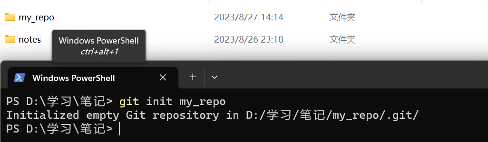
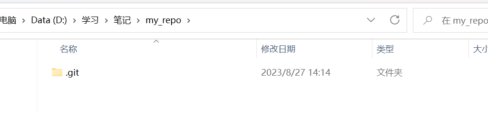
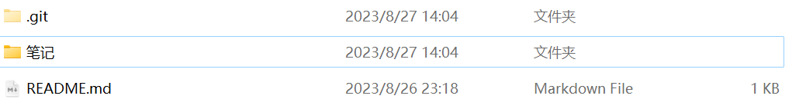
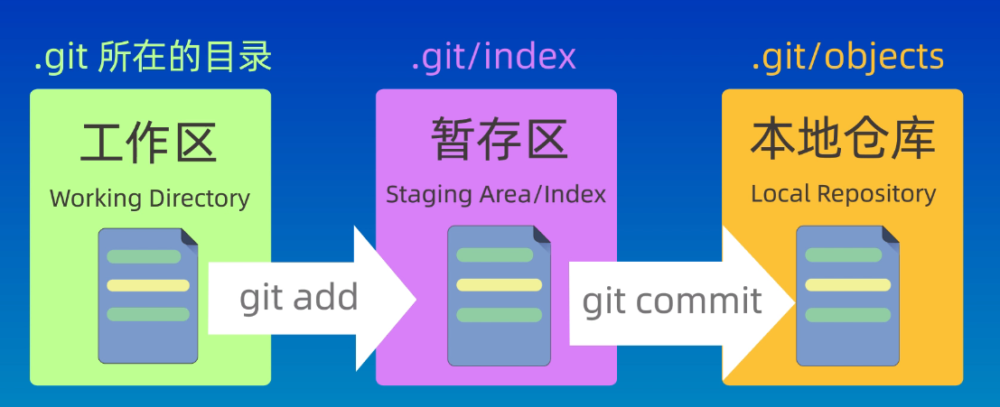
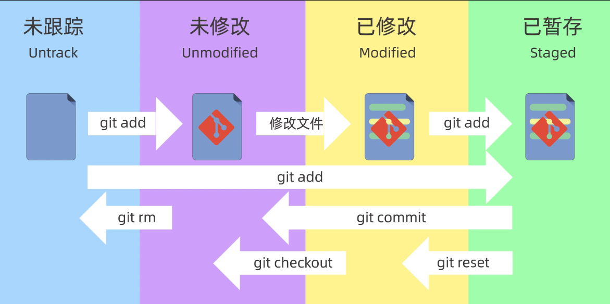
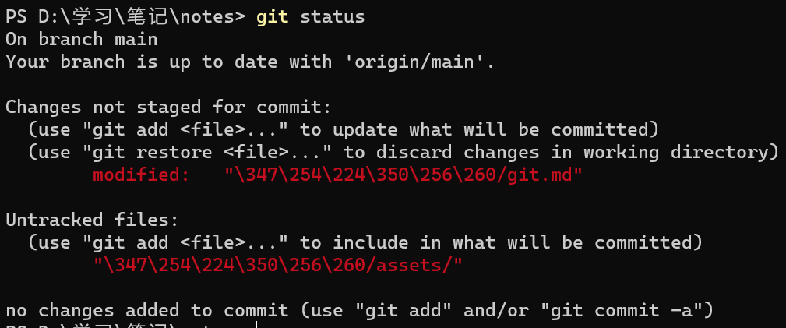
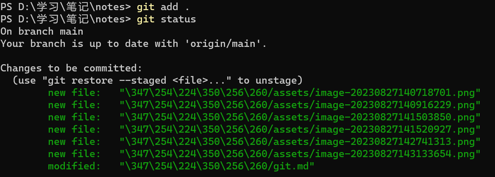
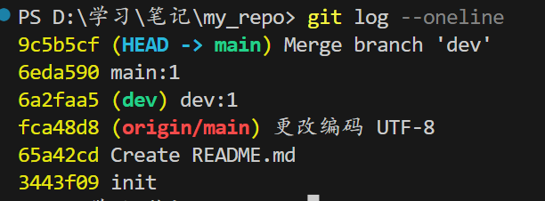
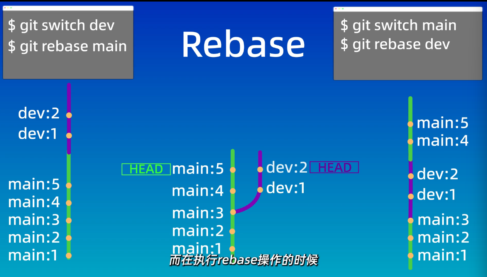
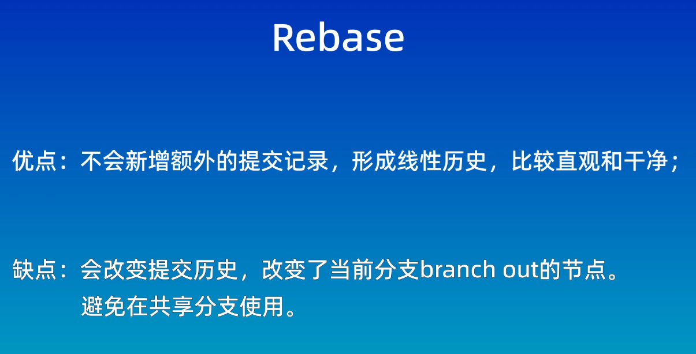

# git笔记


---


## 报错处理

### 超时处理

- 取消代理

~~~git
	git config --global --unset http.proxy
    git config --global --unset https.proxy
~~~

- 更新DNS

~~~ git
	ipconfig /flushdns
~~~

- 设置代理

~~~git
 	// 端口号找自己电脑的网络代理
 	git config --global http.proxy http://127.0.0.1:33210
 	git config --global https.proxy https://127.0.0.1:33210
~~~


---


## 初始化处理

### 查看当前版本

```
	git --version
```


### 配置用户名和邮箱

```
	git config --global user.name "Your name"
	git config --global user.email Your_email
```


### 自动保存账户密码

```
	git config --global credential.helper store
```


### 查看所有配置项

```
	git config --global --list
```


---


## 新建仓库

### 方式一 （init）

1. 把当前目录变成Git仓库

```
	git init
```

2. 在当前目录下新建文件夹

```
	git init my_repo
```






### 方式二 （clone）

远程仓库已经创建好

```
	git clone 远程仓库地址
```


- **下图中的 `.git` 隐藏文件是用来存放Git仓库的所有数据的。（删除后就不是Git仓库了）**

​	


---

## 工作区域

### 本地


### 

- 工作区：当前目录（当前文件夹）
- 暂存区：临时存储区域
- 本地仓库：`git init` 创建的本地仓库


### 远程

- 远程仓库：在GitHub等网站创建的远程代码仓库

  可以 `git push` 将本地仓库的代码推送到远程仓库（需要设置好远程仓库）


---


## 添加和提交文件

### 查看仓库状态

```
	git status
```

可以查看仓库中文件的变化，有以下四种：



**eg:**



其中第一部分是修改但是没有暂存  ， 第二部分是未被跟踪（新建文件）。


### 提交到暂存区

```
git add file
```

- 可以使用 `git add .`	全部提交




### 提交到本地仓库

```
git commit -m "提交信息"
```

- 只会提交在暂存区中文件

- 可以使用 `git log` 查看提交记录，使用 `git log --oneline` 查看简洁的提交记录


---


## git reset 回退版本

### 三种方式

- ```
  git reset --soft 版本编号
  ```

  回退到某一个版本，并且保留工作区和暂存区的所有修改内容

- ```
  git reset --hard 版本编号
  ```

  回退到某一个版本，并且丢弃工作区和暂存区的所有修改内容

- ```
  git reset --mixed 版本编号
  ```

  回退到某一个版本，并且保留工作区，丢弃暂存区


如果回退失误可以使用 `git reflog`  查看操作前的版本号，进行回退。


---


## git diff  差异查看

- 对比工作区和暂存区

```
git diff
```

- 对比工作区和本地仓库

```
git diff HEAD
```

​		**`HEAD` 指向最新提交节点**

-  对比暂存区和本地仓库

```
git diff --cached
```

- 对比两个版本

```
git diff 版本编号1 版本编号2
```

- 对比当前版本和上一个版本

```
git diff HEAD~ HEAD
```

​		`HEAD~2`  、`HEAD~3` 分别表示前两个和前三个版本


---


## git rm 删除文件

### git rm使用

```
	git rm file
```

可以同时删除工作区和暂存区的文件


### 查看暂存区的内容

```
	git ls-files
```


---


## .gitignore 忽略文件

出了点小问题 —— 不能忽略              以后补上


---


## 远程仓库

### 远程地址方式

1. HTTPS 

​	   在将本地代码推送至远程仓库时，需要验证用户名和密码。

2. SSH （**推荐**）

   在将本地代码推送至远程仓库时，不需要验证用户名和密码，但是需要配置密钥。

### **ssh 密钥配置**（以GitHub为例）

a. 输入以下命令之后，设置好密码就会生成私钥和公钥。（设置空密码就行，之后的操作就可以免密）

```cmd
ssh-keygen -t rsa -C "email"
```

b. 将生成的公钥设置在GitHub上

c. 输入以下指令并输入密码来测试是否设置成功

```cmd
	ssh -T git@github.com
```


---


## 关联本地仓库和远程仓库

### 关联远程仓库

1. ```
   git remote add origin 远程仓库地址
   ```

   - `git remote add`: 这是用于管理远程仓库的命令，其中 `add` 是指添加一个新的远程仓库。
   - `origin`: 这是一个常用的**名称**，用于**标识远程仓库**。你可以选择其他名称，但通常情况下使用 "origin"。
   - `远程仓库地址`: 这是指远程仓库的URL，它可以是你在托管平台（如GitHub、GitLab、Bitbucket等）上创建的仓库的URL。

   之后，你就可以使用 `origin` 来引用这个远程仓库，例如：

   - `git push origin`：将本地提交推送到名为 "origin" 的远程仓库。
   - `git pull origin`：从名为 "origin" 的远程仓库拉取更新到本地。

   可以通过 `git remote -v` 查看远程仓库的相关信息

2. ```
   git branch -M main 
   ```

   这个命令用于将 Git 仓库中默认的分支（通常是 "master"）重命名为 "main"。这种改变在软件开发中变得越来越流行，旨在推广更具包容性和不带有种族歧视色彩的语言。"master" 分支名称因其与历史和当代的种族问题关联而受到批评。

   `-M`：这是一个标志，代表 "move" 或 "move/rename"，用于将分支进行移动或重命名操作。

   

### 推送

将本地的修改推送

3. ```
   git push -u origin main
   ```

   解释命令中的各个部分：

   - `git push`: 这是将本地提交推送到远程仓库的命令。

   - `-u`: 这是 `--set-upstream` 的缩写，用于建立本地分支与远程分支之间的追踪关系。设置好之后就可有直接使用 `git push/pull` 命令进行推送和拉取。

   - `origin`: 这是远程仓库的名称，通常用于指代你所添加的远程仓库。

     这个名称就**可以让我们连接多个远程仓库**，根据名称区分。

   - `main`: 这是你要推送的本地分支的名称。

   如果本地分支和远程分支的名字不一样，需要用到以下命令

   ```
   git push origin <local_branch_name>:<remote_branch_name>
   ```

   在这个命令中：

   - `<local_branch_name>` 是你要推送的本地分支的名称。
   - `<remote_branch_name>` 是你希望在远程仓库上创建或更新的分支的名称。

   

### 拉取

将远程的修改拉取

```
git pull
```

 后缀与上述 `push` 类似

 该命令在拉取远程的修改后，会自动合并一次，如果没有冲突，则合并成功。


```
git fetch
```

这个命令则只会拉取，不会自动合并。


---


## 分支

### 创建新分支

```
git branch 分支名
```

- 一般一个项目的不同功能是并行开发的，多个分支并行开发。

### 查看分支

```
git branch
```

- `-a` 表示所有分支
- `-r` 表示远程分支


### 切换分支

```
git checkout 分支名
```

- 专门用来切换分支

```
git switch 分支名
```


### 合并分支

- 首先切换到目标分支，然后使用以下命令。

```
git merge 要合并的分支名
```




### 显示分支图

```
git log --graph --oneline --decorate --all
```


### 删除分支

```
git branch -d 分支名
git branch -D 分支名
```

`-d` 删除已合并的分支

`-D` 强制删除，不管是否合并


---


## 解决分支合并冲突

解决 Git 分支合并冲突通常涉及以下步骤：

1. **获取最新代码：** 在合并分支之前，确保你的本地仓库是最新的。使用以下命令拉取最新的远程代码：

   ```
   git fetch origin
   ```

2. **切换到目标分支：** 首先，切换到你要合并到的目标分支，比如主分支：

   ```
   git checkout main
   ```

3. **合并分支：** 执行合并命令，将目标分支合并到当前分支（主分支）：

   ```
   git merge feature-branch
   ```

   这会将名为 `feature-branch` 的分支合并到主分支中。

4. **解决冲突：** 如果存在冲突，Git 会在合并过程中停下来并提示你解决冲突。冲突会显示在带有冲突标记的文件中，你需要手动编辑这些文件以解决冲突。

   打开冲突文件，你会看到类似以下的内容：

   ```plaintext
   <<<<<<< HEAD
   // 代码在主分支的版本
   =======
   // 代码在要合并的分支的版本
   >>>>>>> feature-branch
   ```

   你需要决定要保留哪个版本，或者根据需要进行修改，然后删除冲突标记。

5. **提交解决冲突后的代码：** 在你解决完所有冲突并编辑了文件后，使用以下命令提交解决冲突后的代码：

   ```
   git add .       # 添加修改后的文件
   git commit -m "Resolve merge conflict"
   ```

6. **完成合并：** 提交解决冲突的代码后，合并就完成了。

7. **推送更改：** 如果你想将这些更改推送到远程仓库，使用以下命令：

   ```
   git push origin main
   ```

以上是一般的合并冲突解决步骤。要注意的是，解决冲突可能会需要一些代码审查和测试，特别是在团队合作环境中。在解决冲突时，保持与团队成员的沟通是很重要的。


---


## git rebase 进行分支“合并”



```
git rebase 目标分支名
```

- 将当前分支换基到目标分支

  **注：**换基之后，**分支依然存在**，类似于**嫁接**在目标分支上，删除后就消失。**与合并分支不同**。


### merge 和 rebase 对比





---


## Gitflow 开发模型

Gitflow 是一种流行的 Git 分支管理工作流模型，它提供了一套定义良好的分支结构和规则，以支持团队在软件开发过程中的合作。这种模型有助于管理功能开发、版本发布和热修复等活动。Gitflow 模型定义了几种主要的分支类型和它们之间的关系。

以下是 Gitflow 模型中的主要分支类型：

1. **主分支（`master`）：**
   
   `master` 分支是用于发布稳定版本的分支。在 `master` 分支上的代码应该是经过测试和审核的，可以随时部署到生产环境中。新的功能和修复应该通过其他分支合并到 `master` 分支。

2. **开发分支（`develop`）：**
   
   `develop` 分支是集成开发团队成员的工作的主要分支。它应该包含所有即将发布的功能和修复的代码。从其他分支合并到 `develop` 分支，以便在进行新功能开发和测试时，保持代码的一致性。

3. **功能分支（Feature branches）：**
   
   每个新功能都应该在自己的独立功能分支上开发。这些分支从 `develop` 分支分离，用于开发单个功能。一旦功能完成并通过测试，它可以合并回 `develop` 分支，以便在下一个版本中发布。

4. **发布分支（Release branches）：**
   
   发布分支用于准备新的版本发布。从 `develop` 分支分离出来，这个分支可以用于进行最终测试、修复错误和版本号更新等操作。一旦准备就绪，发布分支可以合并回 `master` 分支以及 `develop` 分支，然后发布新版本。

5. **热修复分支（Hotfix branches）：**
   
   热修复分支用于紧急修复生产环境中的 bug。从 `master` 分支分离，修复完成后，它会合并回 `master` 分支和 `develop` 分支。这样可以确保修复也会包含在下一个版本的发布中。

Gitflow 模型的主要优势在于它提供了一种结构化的方式来管理不同类型的任务，从而降低了合并冲突和混乱的风险。然而，它可能在较大的团队或快速迭代的项目中变得复杂，因此在选择开发工作流时，需要考虑项目的特点和团队的需求。
